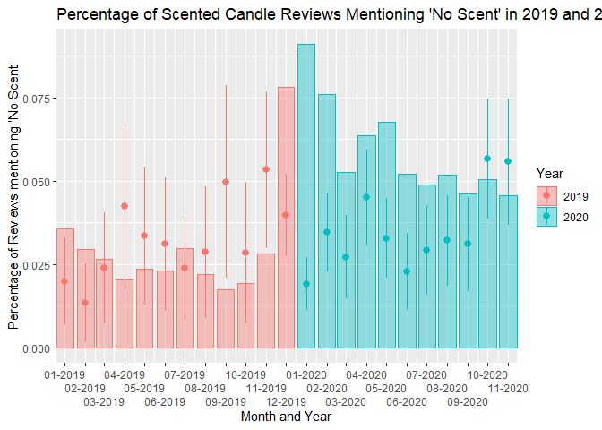

Consequences of Covid-19 for Candle Critiques
================
Tyler Allan
3/22/2021

This work is doing using data from amazon describing the following
information for the Top 3 selling scented or unscented candles:
(information given describes the varibale name then gives a description
of what that variable is)

1.  `CandleID`: A numeric id variable for candle 1-3 in each category.
2.  `Date`: The date of the review.
3.  `Rating`: The 1-5 rating for the review.
4.  `Review`: For the scented candles, the text of the review.

## Part 1: Average daily ratings for scented and unscented candles

``` r
Scented_Plot <- Scented_all %>%
  filter(Date > "2017-01-01") %>% #making it so the dataset only includes data from after 2017-01-01
  group_by(Date) %>% #grouping the data so it will give reviews by the date
  mutate(Avg_Rating = mean(Rating)) %>% #computing an average daily rating for the set
  ggplot(
    aes(x = as.Date(Date),
        y = Avg_Rating
  )) + 
  geom_point(alpha = .5, color = "dark green", shape = 1) +
  scale_x_date(name = "Date", date_breaks = "6 months", date_labels = "%m-%Y") +
  geom_smooth(method = "loess", color = "gold") +
  geom_vline(xintercept = as.numeric(as.Date("2020-01-20")), linetype = "dashed") +
  scale_y_continuous(name = "Average Rating") +
  theme_minimal() +
  ggtitle("Average Scented Candle Reviews") + 
  guides(x = guide_axis(n.dodge = 2))

Unscented_Plot <- Unscented_all %>%
  filter(Date > "2017-01-01") %>%
  group_by(Date) %>% 
  mutate(Avg_Rating = mean(Rating)) %>% 
  ggplot(
    aes(x = as.Date(Date),
        y = Avg_Rating
  )) + 
  geom_point(alpha = .5, color = "dark green", shape = 1) +
  scale_x_date(name = "Date", date_breaks = "6 months", date_labels = "%m-%Y") +
  geom_smooth(method = "loess", color = "gold") +
  geom_vline(xintercept = as.numeric(as.Date("2020-01-20")), linetype = "dashed") + 
  scale_y_continuous(name = "Average Rating") + 
  theme_minimal() +
  ggtitle("Average Unscented Candle Reviews") +
  guides(x = guide_axis(n.dodge = 2))

grid.arrange(Scented_Plot, Unscented_Plot, ncol = 2)
```

    ## `geom_smooth()` using formula 'y ~ x'
    ## `geom_smooth()` using formula 'y ~ x'

<!-- -->

### Description of the Plots

Both plots show a general skew towards the higher end of the scale
meaning people are more likely to leave 5 star reviews than 1 star
reviews. This trend begins to separate after the cutoff line place on
January 20th 2020. Though the trend line for unscented candles does
begin to trend down after January 20th, it does not appear to deviate
enormously from what would be expected results. The average ratings for
scented candles tell a different story. The trend line experiences a
large drop off after January 20th 2020. This large decrease in average
ratings does not appear to be normal for the data and could be related
to individuals not realizing they have lost their sense of smell due to
contracting COVID-19.

## Part 2: Combined plot

``` r
candles_full <- bind_rows(
    scented = Scented_all, 
    unscented = Unscented_all, 
    .id = "Scented"
)
```

``` r
Combined_Plot <- candles_full %>%
  filter(Date > "2017-01-01") %>%
  group_by(Date, Scented) %>% 
  mutate(Avg_Rating = mean(Rating)) %>% 
  ggplot(
    aes(x = as.Date(Date),
        y = Avg_Rating,
        shape = Scented,
        color = Scented,
        fill = Scented
  )) + 
  geom_point(alpha = .3) +
  scale_x_date(name = "Date", date_breaks = "6 months", date_labels = "%m-%Y") +
  geom_smooth(method = "loess") +
  geom_vline(xintercept = as.numeric(as.Date("2020-01-20")), linetype = "dashed") +
  scale_y_continuous(name = "Average Rating") +
  theme_minimal() +
  ggtitle("Average Candle Reviews For Scented and Unscented Candles") + 
  guides(x = guide_axis(n.dodge = 2)) + 
  scale_color_viridis_d()

Combined_Plot
```

    ## `geom_smooth()` using formula 'y ~ x'

<!-- -->

The combined plot is easier to interpret specifically if you are trying
to compare the reviews of unscented and scented candles. Having the data
overlap and specifically having the trend lines on the same graph allows
for a very clear comparison of the two average ratings. Otherwise
individuals would have to compare across the graphs and with both trend
lines trending towards the top of the graph it may be harder to make
accurate comparisons.

## Part 3: Proportion of reviews mentioning “no scent”

``` r
Scented2_Plot <- Scented_all %>%
  filter(Date >= "2019-01-01") %>%
  mutate(month = lubridate::floor_date(Date, "month"),
         noscent = str_no_scent(Review),
         year = ifelse(Date <= as.Date("2019-12-31"),"2019", "2020")) %>% 
  group_by(as.Date(month), noscent) %>% 
  ggplot() +  aes(x = as.Date(month), y = (..count..)/sum(..count..), color = as.factor(year), fill = as.factor(year)) +
  geom_bar(alpha = .4) +
  stat_summary(aes(y = noscent), fun.data = mean_cl_normal) +
  scale_x_date(name = "Month and Year", date_labels = "%m-%Y", date_breaks = "month", expand = c(0,0)) + 
  guides(x = guide_axis(n.dodge = 3), color = guide_legend(title = "Year"), fill = guide_legend(title = "Year")) +
  scale_y_continuous(name = "Percentage of Reviews mentioning 'No Scent'") +
  labs(title = "Percentage of Scented Candle Reviews Mentioning 'No Scent' in 2019 and 2020")


Scented2_Plot
```

<!-- -->

The overall proportion of reviews which indicated that a scented candle
had no scent is larger in 2020 than it was in 2019. A stark increase in
the proportion of reviews indicating there was no scent associated with
the scented candle can be seen in December 2019 and January 2020. This
would align with the beginnings of the spread of COVID-19 before cases
were confirmed in the United States. This increase can be seen as people
unaware their lack of scent was a sign of contracting the novel disease.
The overall mean for these months is lower than the mean later on in
2020 indicating that more people were commenting about a lack of scent
as the year went on. This could possibly be connected to increases in
the cases of COVID-19.
